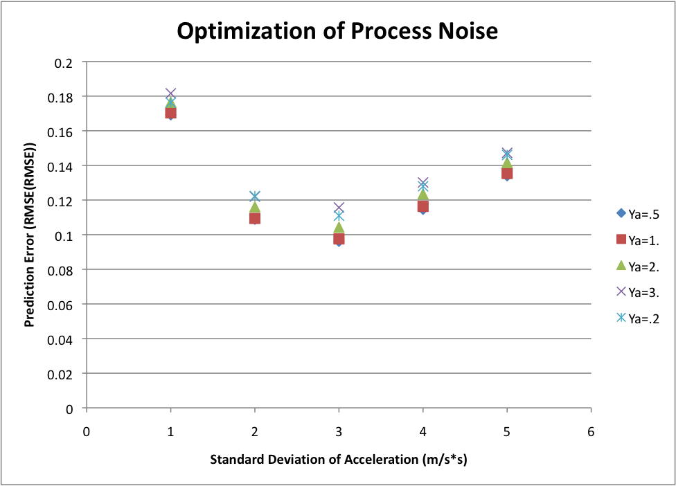
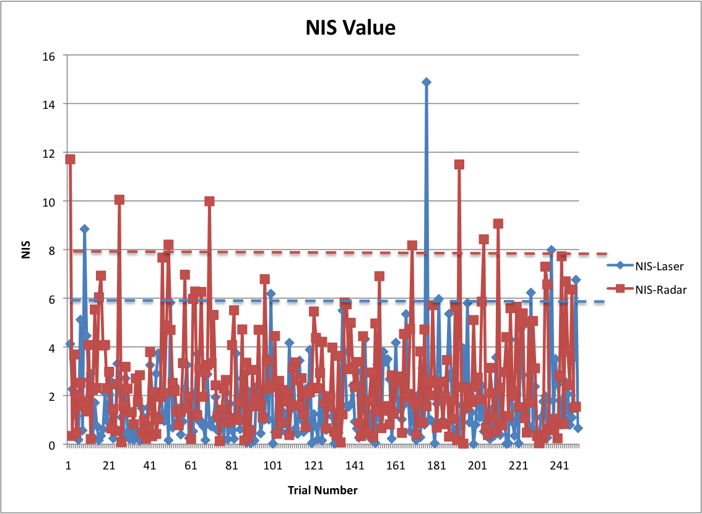

# Unscented Kalman Filter Project

## Project Objective
The object of the project is to complete the supplied code, optimize the process noise parameters and demonstrate that the optimized code "accurately" predicts the system state variables.  It should be noted that this project used a CVTR model, hence, the CVTR state model was used throughout this project.

Starter code was supplied which required completion with the Unscented Kalman Filter algorithm (class UKF).  The UKF class consisted of an initialize, prediction, and update steps.  The purpose of the initialization is to initialize the model state variables with the initial measurement values.  The UKF prediction and update steps were completed using the code developed from the class lessons.

## UKF Evaluation
The project was tested by supplying the completed code with measurement data (radar or laser data) and comparing the predicted state with the "ground truth" state.  The process noise variables (&#963;-a and &#963;-yawdd) are not known apriori, hence a series of evalations were performed to optimize these values for the given measurement data set.  The figure below shows the variation of the total measurement error as function of the linear and yaw accelerations.

The figure shows that the lowest prediction error (difference between the predicted state and ground truth) was 3 and 1 for the standard deviation of the linear and yaw accelerations, respectively.  When using these values of the processes noise, the root mean square error of the predicted state was 0.08, 0.09, 0.24 and 0.24.

The Normalized Innovation Squared (NIS) for the optimal &#963;-a and &#963;-yawdd is shown in the following graph.  The NIS was below 6.0 and 8.0 95% of the time for both the laser and radar measurements, respectively.  This is comparable to the &#935;squared values at 0.05 for 2 degrees of freedom for the laser data and 3 degrees of freedom for the radar data.

The effect of using only laser or radar measurements to track the state was then evaluated.  The table below illustrates the effect of using all the measurements compared to only using the laser or radar measurements.

|State Variable | All data  | Laser Only | Radar Only  |
| ------------- |:-----:| -----:| -----:|
| P_x           | 0.078 | 0.174 | 0.232 |
| P_y           | 0.087 | 0.153 | 0.334 |
| V_x           | 0.238 | 0.395 | 0.358 |
| V_y           | 0.235 | 0.340 | 0.438 |

These results clearly show that the error is much less when using both the laser and radar data.  It also indicates that the predictions using only the laser data is slightly better than only using the radar data.  This is likely due to the fact that the laser measurement are more accurate than the radar measurements.

One final evaluation was performed.  This evaluation compared the predicted velocity to the measured velocity when both the laser and radar measurements were used for the state predictions.  This figure indicates that the predicted velocity tracks the radar measurement velocity.

 
